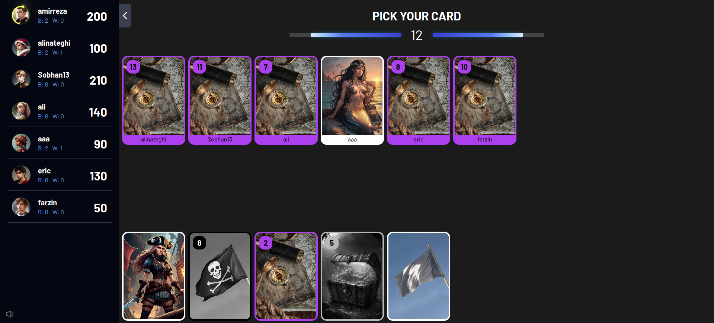

# About Game

This program is a digital version of a board game that belongs to the original series
of [Grandpa Skull King](https://www.grandpabecksgames.com/pages/skull-king).



Skull King is a trick-taking game in which you will bid
the exact number of tricks you predict you will win each
round. You’ll battle with your rivals as you strive to keep
your own bid afloat… while seizing opportunities to also
sink your opponents! The pirate with the highest score at
the end of the game wins and earns the title of Captain of
the Seven Seas!

# Cards

## Suit Cards

- Parrot (14)
- Pirate Map (14)
- Treasure Chest (14)
- Jolly Roger (14)

## Special Cards

- Pirate (5)
- Skull King (1)
- Mermaid (2)
- Escape (5)

## Expansion Cards

- Kraken (1)
- White Whale (1)

> **Loot** and **Tigress** cards are not implemented duo to complexity.

# Rules

- If multiple pirates are played in a trick, the first player who plays one wins it.

- In the rare event that each player plays an escape card in the
same trick; the first card played wins the trick.

- If a Pirate, the Skull King, and a Mermaid are all played in the same trick,
the Mermaid always wins the trick, regardless of order of play.

- The next trick is led by the player who would have won the trick.

- The player to the left of the current round's starting player becomes the starting player for the next round.

## When a suit card is led

If a suit card is played first in a trick (lead), all players must
‘follow suit’and play that same suit (if they are going to
play a numbered card). If you don’t have the suit that was
lead, you may play any other suit.

## When a special card is led

### Leading with an escape

When an Escape is lead, the next player sets the suit that must be followed,
unless they play one of these as well, which would defer setting the suit
to the next player.

### Leading with a character

When a Mermaid, Pirate, Skull King, Kraken, or White Whale
leads a trick, there is no suit to follow for that trick.
Each other player may play any card they choose.

# Scoring

## Bidding One or More

When you win the exact number of tricks that you bid, you
are awarded 20 points for each trick taken.
Capture more or fewer tricks than you bid, and you’ll lose
10 points for every trick you were off. You don’t earn
points for any tricks captured that round.

## Bidding Zero

Bid zero and get your bid correct and your potential score
is 10 points times the number of cards dealt that round.
However, if you bid zero and then take 1 or more tricks,
you’ll lose 10 points per card dealt that round instead.

## Bonus Points

### The Number Fourteen Cards

- **10 points** for each standard suit (yellow, purple, or
  green) 14 card you have at the end of the round.
- **20 points** for possessing the black (Jolly Roger) 14 card at
  the end of the round.

> Every 14 you have at the end of the round earns you a bonus, whether played by you or an opponent.

### Character Cards

Capturing (taking) character cards will earn a bonus:

- 20 points for each Mermaid taken by a Pirate.
- 30 points for each Pirate taken by the Skull King.
- 40 points for taking the Skull King with a Mermaid.

# Setup

## Production

### Nginx

```
server
{
  listen 80;
  server_name api.skullking.ir;
  return 301 https://$host$request_uri;
}

server {
  listen 443 ssl;
  ssl_certificate /etc/letsencrypt/live/skullking.ir/fullchain.pem;
  ssl_certificate_key /etc/letsencrypt/live/skullking.ir/privkey.pem;
  server_name api.skullking.ir;

  location / {
    proxy_pass http://127.0.0.1:3002/;
    proxy_set_header Host $host;
    proxy_set_header X-Forwarded-Host $http_host;
    proxy_set_header X-Real-IP $remote_addr;
    proxy_set_header X-Forwarded-For $proxy_add_x_forwarded_for;
  }

  location /games/join  {
    proxy_pass http://127.0.0.1:3002$request_uri;
    proxy_set_header Host $host;
    proxy_set_header X-Forwarded-For $proxy_add_x_forwarded_for;

    proxy_http_version 1.1;
    proxy_set_header Upgrade $http_upgrade;
    proxy_set_header Connection "upgrade";

    proxy_read_timeout 300;
    proxy_connect_timeout 300;
    proxy_send_timeout 300;
  }
}
```

### Docker

```bash
docker compose -f docker-compose-production.yml up -d --build
```